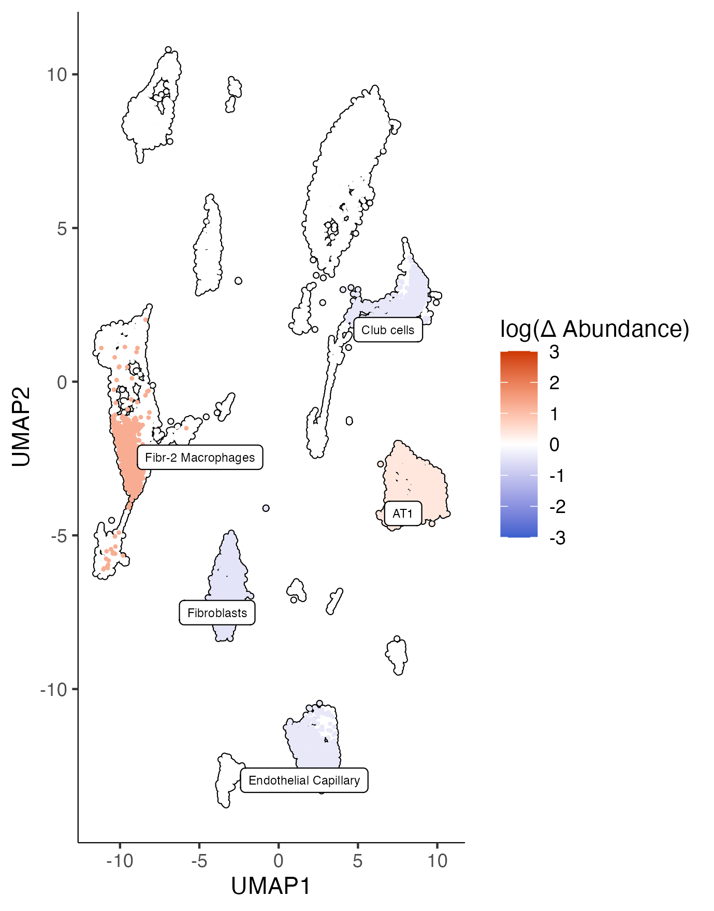
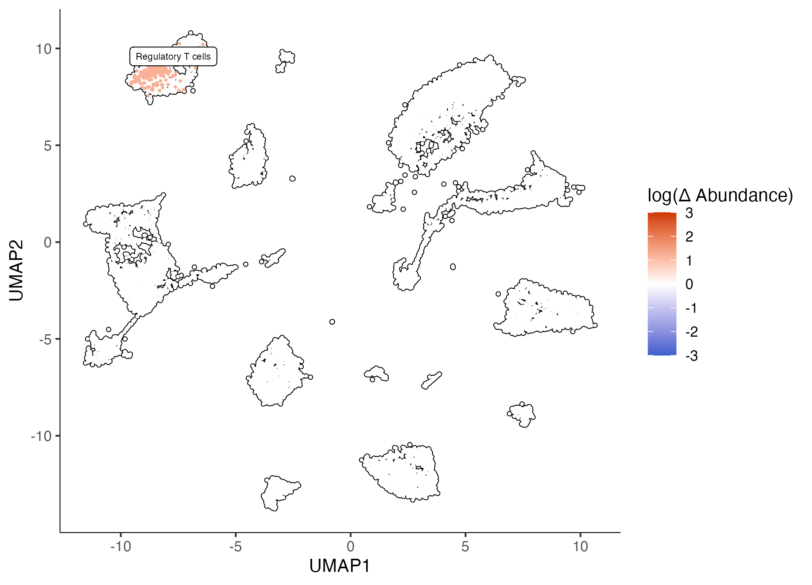

# Differential abundance

Hooke can identify differentially abundant cell types for a given contrast. The underlying PLN model mimics the standard (G)LM-like interface of `R::stats`. This allows users to fit a multivariate Poisson lognormal model after correcting for effects of offsets and covariates. This framework allows users to perform multivariate statistical regression to describe how perturbations alter the relative abundances of each cell state. For example, you could model the effects of genotype (WT vs MT) while controlling for experimental batch. 


## Analysis of differentially abundant cell types in silicosis with Hooke

This data was published in [Hasegawa, Franks, et al. _bioRxiv_](https://www.biorxiv.org/content/10.1101/2023.02.17.528996v1). 
The authors performed a longitudinal transcriptomic analysis using scRNA-sequencing of the lungs from pre- and post-silica challenged mice. 

The data includes 12 whole lung samples across pre- and post- intratracheal silica. 35 unique cell states were identified using highly and specifically expressed marker genes. For simplicity, we are splitting samples into 2 levels: exposed and not exposed. The goal is to identify which cell types are differentially abundant post-silica exposure. 

```
cds = readRDS("silicosis_cds.cds")

# for simplicity, we are lumping together pre and post i.t. silica
colData(cds)$exposed = ifelse(colData(cds)$Timepoint == 0, "not exposed", "exposed")
colData(cds)$Rep = as.factor(colData(cds)$Rep)

plot_cells(cds, color_cells_by = "fine_annotation", label_groups_by_cluster = F)

```


### Making a cell count set object 

The first step of Hooke is to create a `cell_count_set` object. This requires three inputs: 

* `cds` - a monocle3 `cell_data_set` object
* `sample group` -  A column in `colData(cds)` that specifies how cells are grouped into samples
* `cell group` - A column in `colData(cds)` that specifies how cells are grouped into types or states (e.g. cluster)

```
ccs = new_cell_count_set(cds, 
                         sample_group = "ID", 
                         cell_group = "fine_annotation")
```


### Fitting a cell count model 

The next step is to fit a `cell_count_model` given a model formula. This function works with the standard `R formula` notations. 

A cell count model requires the following inputs: 

* `ccs` - a Hooke `cell_count_set` object
* `main_model_formula_str` -  A character string specifying the model of cell abundances across samples, where terms refer to columns in `colData(ccs)`. Put main effects here.
* `nuisance_model_formula_str` - A character string specifying the model of cell abundances across samples. Put nuisance effects here.

In this case we are interested in comparing silica exposed mouse lungs to unexposed lungs. 

```
ccm  = new_cell_count_model(ccs,
                            main_model_formula_str = "~ exposed")
```

### Estimating abundances 

Next we can predict fold change values for a given contrast of interest using `estimate_abundances()`.  

* `ccm` - a Hooke `cell_count_model` object
* `newdata` - A tibble of variables used for the prediction.
* `min_log_abund` - numeric Minimum log abundance value.

```
cond_exp = estimate_abundances(ccm, tibble::tibble(exposed = "exposed"))
cond_not_exp = estimate_abundances(ccm, tibble::tibble(exposed = "not exposed"))

cond_not_exp %>% head()
```

|  exposed    | cell_group           | log_abund | log_abund_se | log_abund_sd
|---|---|---|---|---|
|not exposed |Endothelial Arterial    |   2.87    |   0.196      |   0.559
| not exposed |Endothelial Capillary    |  5.31   |    0.0591    |    0.559
| not exposed |Endothelial Venous      |   3.09    |   0.179     |    0.559
| not exposed |Lymphatic Endothelial   |   2.63    |   0.213     |    0.559
| not exposed |Aerocytes               |   4.06     |  0.110     |    0.559
| not exposed |Fibroblasts             |   5.26     |  0.0607    |    0.559

### Comparing abundances

And then compare two estimates of cell abundances from a Hooke model to identify significant changes with `compare_abundances()`. In this case, exposed vs not exposed. 

* `ccm` - a Hooke `cell_count_model` object
* `cond_x` - A cell type abundance estimate from estimate_abundances().
* `cond_y` - A cell type abundance estimate from estimate_abundances().

```
cond_ne_v_e_tbl = compare_abundances(ccm, cond_not_exp, cond_exp)

cond_ne_v_e_tbl %>% select(cell_group, exposed_x, exposed_y,
                           delta_log_abund, delta_log_abund_se, delta_q_value)

```

| cell_group  | delta_log_abund |  delta_log_abund_se |  delta_q_value |
|---|---|---|---|
| Endothelial Arterial    |      -0.584     |         0.196     |    0.0774 |
| Endothelial Capillary    |     -0.400      |        0.0769    |    0.0131 |
| Endothelial Venous      |    -0.353       |     0.145     |    0.130 |
| Lymphatic Endothelial   |     0.0529       |      0.330    |     0.989 | 
| Aerocytes               |     -0.354      |      0.130      |   0.102 |
| Fibroblasts             |     -0.477      |       0.102      |   0.0131|

### Plotting differential abundance changes on a UMAP

Finally, we can color our UMAP by the fold changes we estimate in `compare_abundances()` using the `plot_contrast()` function. We can select fold changes that are signifiant given a `q_value_thresh`. 

* `ccm`	- A Hooke `cell_count_model` object.
* `cond_b_vs_a_tbl` - A data frame from `compare_abundances()`.
* `log_abundance_thresh` - _numeric_ Select cell groups by log abundance.
* `q_value_thresh` - Remove contrasts whose change in q-value exceeds `q_value_thresh`.

```
plot_contrast(ccm, cond_ne_v_e_tbl, q_value_thresh = 0.05)
```


### Controlling for batch terms

If your data contains multiple experimental batch, Hooke supports batch correction with the use of a nuisance model string term. 

```
ccm_rep  = new_cell_count_model(ccs,
                            main_model_formula_str = "~ exposed",
                            nuisance_model_formula_str = "~ Rep")

cond_exp_rep = estimate_abundances(ccm_rep, tibble::tibble(exposed = "exposed", Rep = "1"))
cond_not_exp_rep = estimate_abundances(ccm_rep, tibble::tibble(exposed = "not exposed", Rep = "1"))
cond_ne_v_e_tbl_rep = compare_abundances(ccm_rep, cond_not_exp_rep, cond_exp_rep)

plot_contrast(ccm_rep, cond_ne_v_e_tbl_rep, q_value_thresh = 0.05)
```

If we control for replicate, we see some difference in significant fold changes. 



