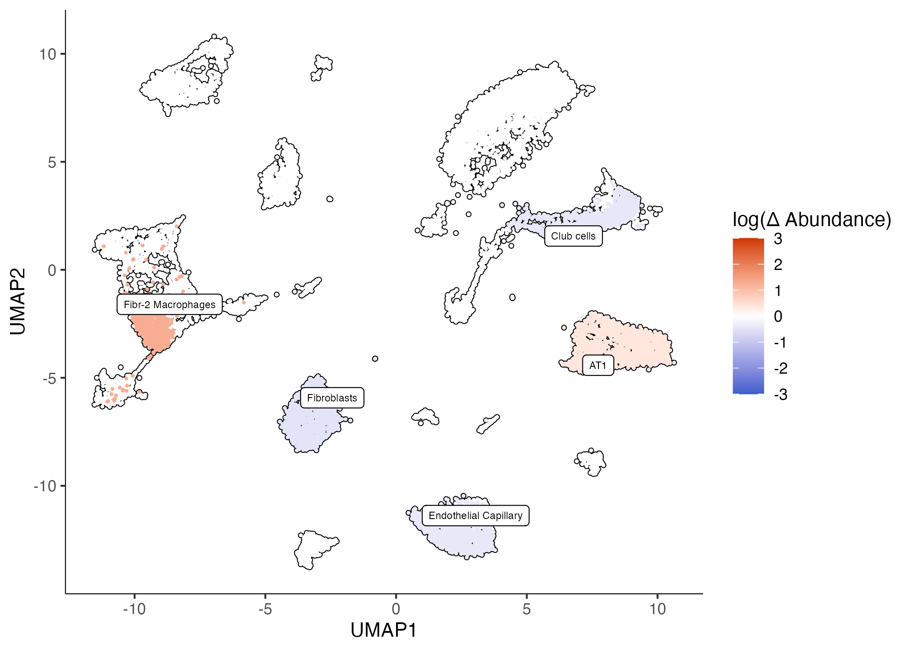

# Analysis of silicosis with Hooke

This data was published in [Hasegawa, Franks, et al. _bioRxiv_](https://www.biorxiv.org/content/10.1101/2023.02.17.528996v1). 
The authors performed a longitudinal transcriptomic analysis using scRNA-sequencing of the lungs from pre- and post-silica challenged mice. 

The data includes 12 whole lung samples across pre- and post- intratracheal silica. 35 unique cell states were identified using highly and specifically expressed marker genes. 

```
cds = readRDS("silicosis_cds.cds")

# for simplicity, we are lumping together pre and post i.t. silica
colData(cds)$exposed = ifelse(colData(cds)$Timepoint == 0, "not exposed", "exposed")
colData(cds)$Rep = as.factor(colData(cds)$Rep)

plot_cells(cds, color_cells_by = "fine_annotation", label_groups_by_cluster = F)

```


### Making a cell count set object 

The first step of Hooke is to create a `cell_count_set`. This requires three inputs: 

* `cds` - a monocle3 `cell_data_set` object
* `sample group` -  A column in `colData(cds)` that specifies how cells are grouped into samples
* `cell group` - A column in `colData(cds)` that specifies how cells are grouped into types or states (e.g. cluster)

```
ccs = new_cell_count_set(cds, 
                         sample_group = "ID", 
                         cell_group = "fine_annotation")
```


### Fitting a cell count model 

A cell count model requires the following inputs: 

* `ccs` - a Hooke `cell_count_set` object
* `main_model_formula_str` -  A character string specifying the model of cell abundances across samples, where terms refer to columns in `colData(ccs)`. Put main effects here.
* `nuisance_model_formula_str` - A character string specifying the model of cell abundances across samples. Put nuisance effects here.

```
ccm  = new_cell_count_model(ccs,
                            main_model_formula_str = "~ exposed")
```


### Estimating abundances 

* `ccm` - a Hooke `cell_count_model` object
* `newdata` - A tibble of variables used for the prediction.
* `min_log_abund` - numeric Minimum log abundance value.

```
cond_exp = estimate_abundances(ccm, tibble::tibble(exposed = "exposed"))
cond_not_exp = estimate_abundances(ccm, tibble::tibble(exposed = "not exposed"))

cond_not_exp %>% head()
```


|  exposed    | cell_group           | log_abund | log_abund_se | log_abund_sd
|---|---|---|---|---|
|not exposed |Endothelial Arterial    |   2.87    |   0.196      |   0.559
| not exposed |Endothelial Capillary    |  5.31   |    0.0591    |    0.559
| not exposed |Endothelial Venous      |   3.09    |   0.179     |    0.559
| not exposed |Lymphatic Endothelial   |   2.63    |   0.213     |    0.559
| not exposed |Aerocytes               |   4.06     |  0.110     |    0.559
| not exposed |Fibroblasts             |   5.26     |  0.0607    |    0.559

### Comparing abundances

* `ccm` - a Hooke `cell_count_model` object
* `cond_x` - A cell type abundance estimate from estimate_abundances().
* `cond_y` - A cell type abundance estimate from estimate_abundances().

```
cond_ne_v_e_tbl = compare_abundances(ccm, cond_not_exp, cond_exp)

cond_ne_v_e_tbl %>% select(cell_group, perturbation_x, perturbation_y, 
                           delta_log_abund, delta_log_abund_se, delta_q_value)

```

| cell_group  | delta_log_abund |  delta_log_abund_se |  delta_q_value |
|---|---|---|---|
| Endothelial Arterial     |      -0.520        |       0.268   |       0.225 | 
| Endothelial Capillary     |     -0.400        |       0.0799  |       0.0109| 
| Endothelial Venous        |     -0.332        |       0.237   |       0.356 | 
| Lymphatic Endothelial    |       0.0650       |       0.283   |       0.925 | 
| Aerocytes                |      -0.351        |       0.148   |       0.143 | 
| Fibroblasts              |      -0.477        |       0.0877  |       0.0109| 

### Plotting differential abundance changes on a UMAP

* `ccm`	- A Hooke `cell_count_model` object.
* `cond_b_vs_a_tbl` - A data frame from `compare_abundances()`.
* `log_abundance_thresh` - _numeric_ Select cell groups by log abundance.
* `q_value_threshold` - Remove contrasts whose change in q-value exceeds `q_value_thresh`.


```
plot_contrast(ccm, cond_ne_v_e_tbl, q_value_threshold = 0.05)
```


### Controlling for batch terms

If your data contains multiple experimental batch, Hooke supports batch correction with the use of a nuisance model string term. 

```
ccm  = new_cell_count_model(ccs,
                            main_model_formula_str = "~ exposed", 
                            nuisance_model_formula_str = "~ Rep")

cond_exp = estimate_abundances(ccm, tibble::tibble(exposed = "exposed", Rep = "3"))
cond_not_exp = estimate_abundances(ccm, tibble::tibble(exposed = "not exposed", Rep = "3"))
cond_ne_v_e_tbl = compare_abundances(ccm, cond_not_exp, cond_exp)

plot_contrast(ccm, cond_ne_v_e_tbl, q_value_thresh = 0.05)
```

Transitional interstitial macrophages and regulatory T cells no longer come up as significant if we control for replicate. 


