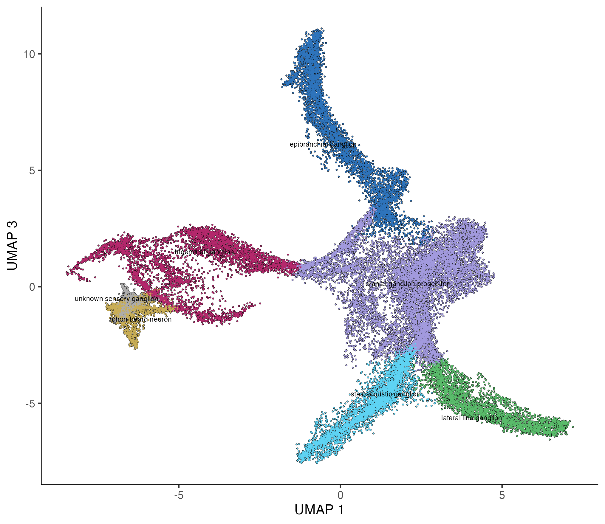
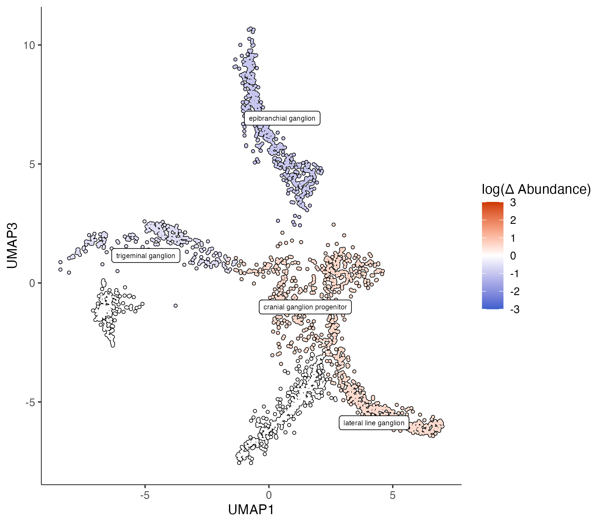
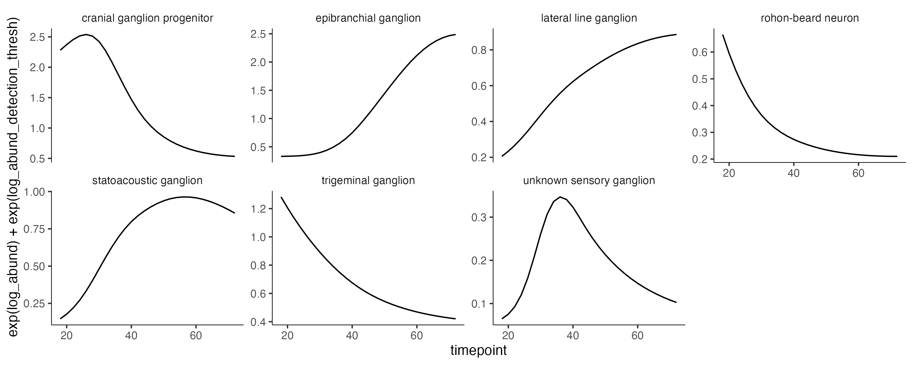
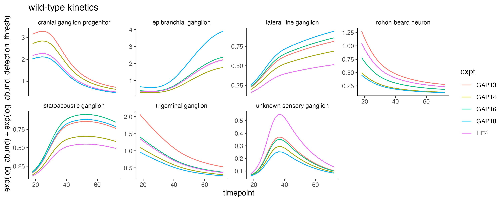
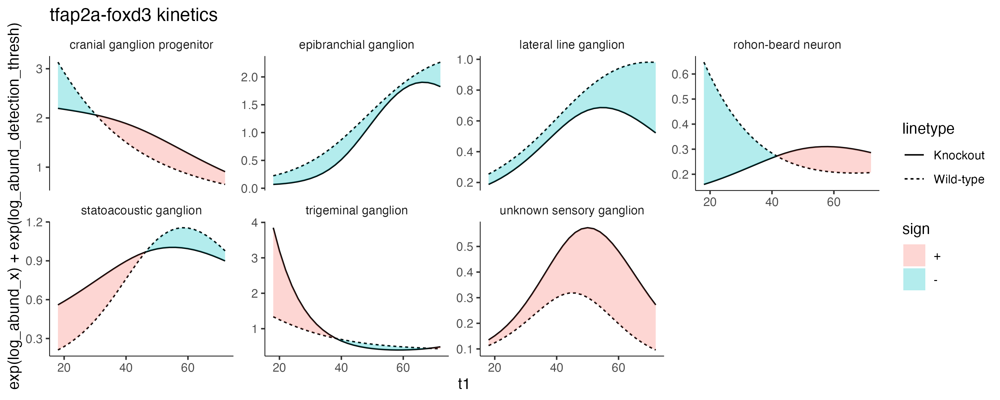

# Analyzing time series perturbation data with Hooke

Hooke can be used to analyze data with multiple time points across perturbations, such as the data found in 
[Saunders, Srivatsan, et al. Nature, in press (2023)](https://www.biorxiv.org/content/10.1101/2022.08.04.502764v1). This study in includes ~3 million single cells across almost 2000 individual barcoded embryos. It includes 19 timepoints (18-96 hpf) and 23 genetic loss of function experiments. For more information see the [ZSCAPE website](https://cole-trapnell-lab.github.io/zscape/). 


### Analysis of cranial sensory ganglia with Hooke

This vignette focuses on the cranial sensory ganglia subset. Cranial sensory neurons transmit information from the head, ear, heart and viscera. Around 30,000 cranial sensory neurons (~20 cells/embryo) were identified. These cells were annotated by comparing branch specific gene expression with published expression data.

{width=75%}

#### Fitting a Hooke model with model time points

_Foxi1_ and _phox2a_ are two transcription factors important for cranial sensory ganglia development. Here we subset the `cds` to focus on those perturbations. We also include all the controls in our `cell count set` construction. 

```

control_ids = c("ctrl-uninj", "ctrl-inj", "ctrl-hgfa", "ctrl-met", "ctrl-mafba", "ctrl-noto", "ctrl-tbx16")
cds = cds[, colData(cds)$gene_target %in% c("phox2a", "foxi1", control_ids)]

colData(cds)$perturbation = ifelse(colData(cds)$gene_target %in% control_ids, 
                                   "control", 
                                   colData(cds)$gene_target) 
                                   
ccs = new_cell_count_set(cds, 
                         sample_group = "embryo", 
                         cell_group = "cell_type_sub")
```

The function`build_interval_formula()` builds a model formula for time series models based on the range of the data. This is a utility function that puts the knots in reasonable positions based on the range of the data. It takes the following as input: 

* `ccs`- a Hooke `cell_count_set` object. 
* `num_breaks` - specifies degrees of freedom
* `interval_var` - name of the column that the interval should be based on 
* `interval_start`- defaults to the `min(interval_var)` value
* `interval_stop` - defaults to the `max(interval_var)` value


_Note: if using this function or specifying your own spline, you must load `library(spline)`. Putting `splines::ns()` in your model formula will result in an error as the model reads it as an interaction term._

```
start_time = 18
stop_time = 72
time_formula = build_interval_formula(ccs, num_breaks = 3, interval_start = 18, interval_stop = 72)
```
The resulting time formula is `~ ns(timepoint , knots= c(45))`


We can fit a `cell_count_model` using this time formula and a perturbation term... 

```
ccm = new_cell_count_model(ccs, 
                           main_model_formula_str = paste0(time_formula, "+ perturbation"))

# predict for 48 hpf 
cond_wt = estimate_abundances(ccm, tibble(timepoint = 48, perturbation = "control"))
cond_phox2a = estimate_abundances(ccm, tibble(timepoint = 48, perturbation = "phox2a"))
cond_foxi1 = estimate_abundances(ccm, tibble(timepoint = 48, perturbation = "foxi1"))

wt_v_phox2a_tbl = compare_abundances(ccm, cond_wt, cond_phox2a)
wt_v_foxi1_tbl = compare_abundances(ccm, cond_wt, cond_foxi1)
```

... and plot the abundance changes. 

```
plot_contrast(ccm, wt_v_phox2a_tbl, x=1, y=3, q_value_thresh = 0.05)
```

{width=75%}


#### Using Hooke time intervals to view kinetics 

We can use Hooke to view when cell types are at their peak abundance in the dataset. Here we are just looking at wild-type data and estimating abundances over a time interval. 

```

wt_cds = cds[, colData(cds)$gene_target %in% control_ids]
wt_ccs = new_cell_count_set(wt_cds, 
                           sample_group = "embryo", 
                           cell_group = "cell_type_sub")

colData(wt_ccs)$timepoint = as.numeric(colData(wt_ccs)$timepoint)
wt_ccm = new_cell_count_model(wt_ccs, 
                              main_model_formula_str = "ns(timepoint, df=3)")

wt_timepoint_pred_df = estimate_abundances_over_interval(wt_ccm, 
                                                         interval_start=18, 
                                                         interval_stop=72, 
                                                         interval_col="timepoint", 
                                                         interval_step=2)

log_abund_detection_thresh=-3

ggplot(wt_timepoint_pred_df, aes(x = timepoint)) +
  geom_line(aes(y = exp(log_abund) + exp(log_abund_detection_thresh))) +
  facet_wrap(~cell_group, scales="free_y") + monocle3:::monocle_theme_opts()

```



##### Controlling for batch effects

If the data was collected in multiple batches, you can also include a `nuisance_model_formula_str` and plot each experimental batch's kinetics. 

```

wt_expt_ccm = new_cell_count_model(wt_ccs, 
                                   main_model_formula_str = "ns(timepoint, df=3)", 
                                   nuisance_model_formula_str = "~ expt")

batches = data.frame(batch = unique(colData(wt_ccs)$expt))                                   
batches = batches %>% mutate(tp_preds = purrr::map(.f = function(batch) {
 estimate_abundances_over_interval(wt_expt_ccm,
                                            start_time,
                                            stop_time,
                                            knockout=FALSE,
                                            interval_col="timepoint",
                                            interval_step=2,
                                            tibble(expt = batch))
}, .x=batch))

wt_timepoint_pred_df = batches %>% select(tp_preds) %>% tidyr::unnest(tp_preds)

ggplot(wt_timepoint_pred_df, aes(x = timepoint)) +
  geom_line(aes(y = exp(log_abund) + exp(log_abund_detection_thresh), color=expt)) +
  facet_wrap(~cell_group, scales="free_y", nrow = 2) + monocle3:::monocle_theme_opts() + 
  ggtitle("wild-type kinetics by expt")

```




##### Perturbation kinetics

We can also plot a given perturbation's kinetics against the wild type. 

```

tfap2afoxd3_cds = cds[, colData(cds)$gene_target %in% c("tfap2a-foxd3", control_ids)]

colData(tfap2afoxd3_cds)$gene_target = ifelse(colData(tfap2afoxd3_cds)$gene_target %in% control_ids, 
                                              "control", colData(tfap2afoxd3_cds)$gene_target)
                                              
tfap2afoxd3_ccs = new_cell_count_set(tfap2afoxd3_cds, 
                                     sample_group = "embryo", 
                                     cell_group = "cell_type_sub")

colData(tfap2afoxd3_ccs)$timepoint = as.numeric(colData(tfap2afoxd3_ccs)$timepoint)

                                
start_time = 18
stop_time = 72

time_formula = build_interval_formula(tfap2afoxd3_ccs, num_breaks = 3, interval_start = 18, interval_stop = 72)


tfap2afoxd3_ccm = new_cell_count_model(tfap2afoxd3_ccs, 
                                .     main_model_formula_str = paste0(time_formula, "* perturbation" ))
                             
wt_timepoint_pred_df = estimate_abundances_over_interval(tfap2afoxd3_ccm, 
                                                                 interval_start=start_time, 
                                                                 interval_stop=stop_time, 
                                                                 interval_col="timepoint", 
                                                                 interval_step=2, 
                                                                 tibble(perturbation = "control"))

ko_timepoint_pred_df = estimate_abundances_over_interval(tfap2afoxd3_ccm, 
                                                                 interval_start=start_time, 
                                                                 interval_stop=stop_time, 
                                                                 interval_col="timepoint", 
                                                                 interval_step=2, 
                                                                 tibble(perturbation = "tfap2a-foxd3"))
timepoints = seq(start_time, stop_time, 2)
perturb_vs_wt_nodes = tibble(t1=timepoints) %>%
  mutate(comp_abund = purrr::map(.f = compare_ko_to_wt_at_timepoint,
                                 .x = t1,
                                 perturbation_ccm=tfap2afoxd3_ccm,
                                 interval_col="timepoint",
                                 wt_pred_df = wt_timepoint_pred_df,
                                 ko_pred_df = ko_timepoint_pred_df)) %>% 
  tidyr::unnest(comp_abund)

log_abund_detection_thresh=-3

ggplot(perturb_vs_wt_nodes, aes(x = t1)) +
  geom_line(aes(y = exp(log_abund_x) + exp(log_abund_detection_thresh), linetype = "Wild-type")) +
  geom_line(aes(y = exp(log_abund_y) + exp(log_abund_detection_thresh), linetype = "Knockout")) +
  ggh4x::stat_difference(aes(ymin = exp(log_abund_x)+exp(log_abund_detection_thresh), ymax = exp(log_abund_y) +exp(log_abund_detection_thresh)), alpha=0.3) + 
  facet_wrap(~cell_group, scales="free_y", nrow=2) + monocle3:::monocle_theme_opts() + ggtitle("tfap2afoxd3 kinetics")


```

