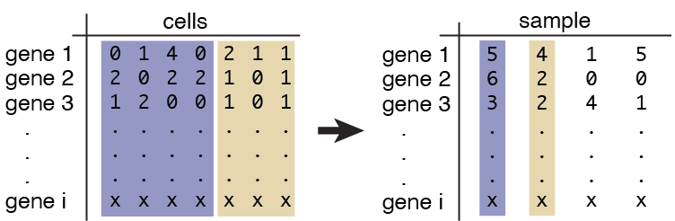
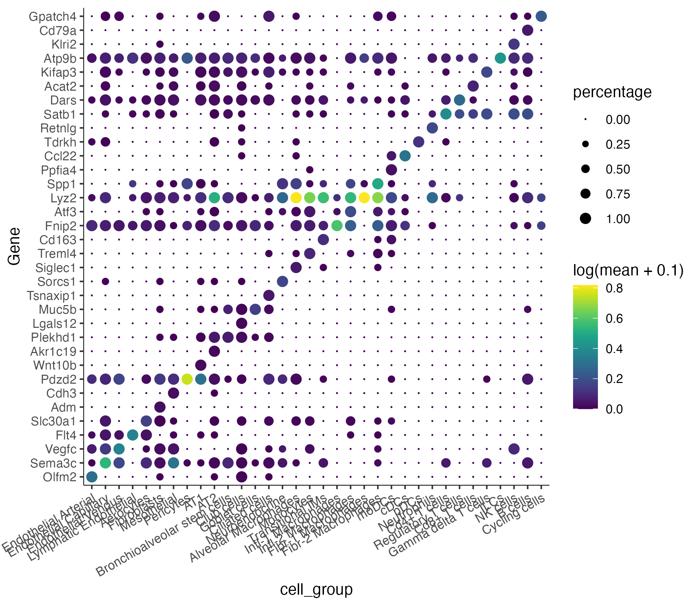
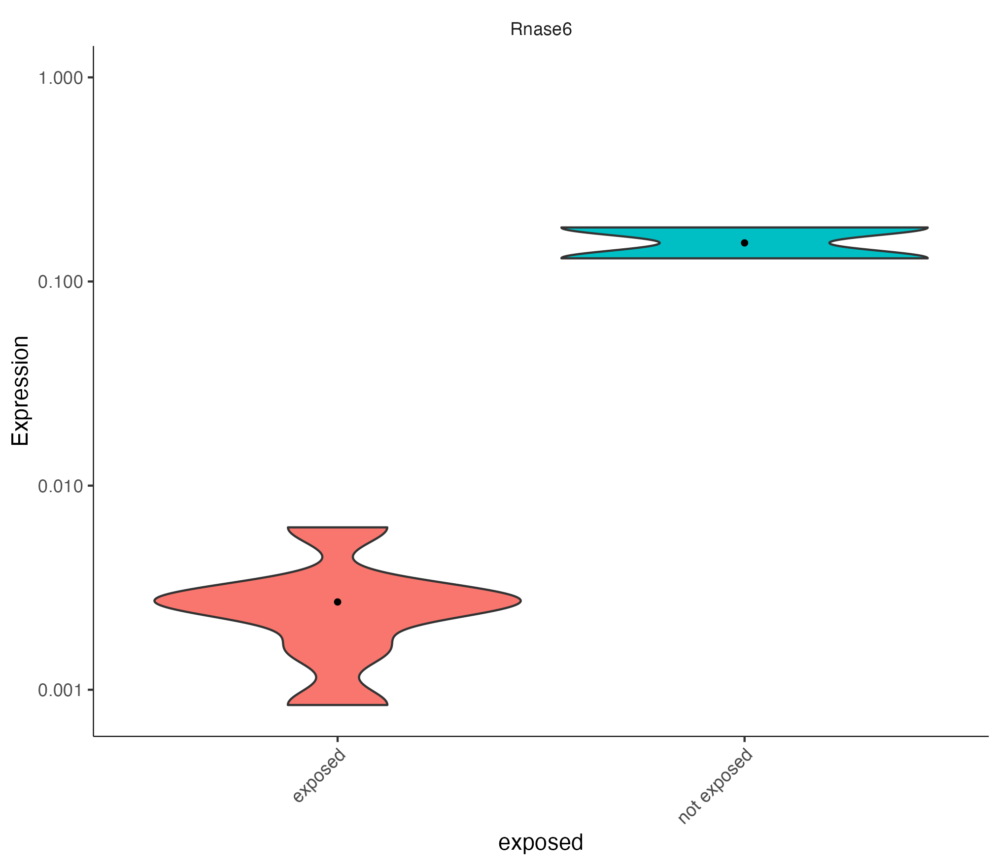

# Differential Expression


### Pseudobulking 

Expression values are aggregated for each embryo each cell into "pseudo-cells". 

{width=75%}

The aggregation matches that of the `ccs`. 

* `ccs` - a Hooke `cell_count_set` object. 

```
pb_cds = pseudobulk_ccs_for_states(ccs)
```

To add a column from the `colData(ccs)`, use the `add_covariate()` function. It requires three inputs: 

* `ccs` - a Hooke `cell_count_set` object. 
* `pb_cds` - a pseudobulked-cds from `pseudobulk_ccs_for_states`.
* `covariate` - a column to add from the `colData(ccs)`.
```
# this covariate we are adding will be required for our future model formula 
pb_cds = add_covariate(ccs, pb_cds, "exposed")
```


### Finding top markers

We can identify top markers for each cell type in the `ccs`. See the [monocle3 website](https://cole-trapnell-lab.github.io/monocle3/docs/clustering/#find-markers) for more in-depth documentation on how to use `top_markers()`. 


```
# subset to control cells only
wt_pb_cds = pb_cds[, colData(pb_cds)$perturbation == "not exposed"]

marker_test_res = top_markers(wt_pb_cds, group_cells_by = "cell_group")

top_specific_markers <- marker_test_res %>%
  filter(fraction_expressing >= 0.10) %>%
  group_by(cell_group) %>%
  top_n(1, pseudo_R2)

top_specific_marker_ids <- unique(top_specific_markers %>% pull(gene_id))

plot_genes_by_group(wt_pb_cds,
                    top_specific_marker_ids,
                    group_cells_by="cell_group",
                    ordering_type="maximal_on_diag",
                    max.size=3)
```




### Running fit models

We have modified the `fit_models` function in Monocle3 to take a `weights` argument which is the number of cells in each group. This allows the number of observations to reflect the number of cells, not just the number of pseudobulks. Here, we test one cell type that came up as significantly differentially abundant, `Fibr-2 Macrophages`. See the [monocle3 website](https://cole-trapnell-lab.github.io/monocle3/docs/differential/) for more in-depth documentation on how to use `fit_models()`. 

```
# subset the pseudobulked cds to one cell type
fm_pb_cds = pb_cds[, colData(pb_cds)$cell_group %in% c("Fibr-2 Macrophages")]

# test for differentially expressed genes between silica exposed and control Fibr-2 macrophages
gene_fits <- fit_models(fm_pb_cds, 
                        model_formula_str = "~exposed", 
                        weights=colData(fm_pb_cds)$num_cells_in_group)

fit_coefs <- coefficient_table(fm_gene_fits)  

FM_genes = fit_coefs %>% 
              filter(grepl("exposed", term)) %>% 
              filter (q_value < 0.05) %>%
              select(gene_short_name, term, q_value, estimate) %>% 
              pull(gene_short_name)


plot_genes_violin(fm_pb_cds[rowData(fm_pb_cds)$gene_short_name %in% FM_genes,], 
                  group_cells_by="perturbation", ncol=length(FM_genes)) +
  theme(axis.text.x=element_text(angle=45, hjust=1))

```
{width=75%}


