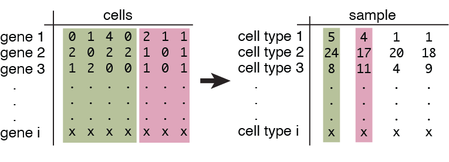

# Overview
        
Hooke is a new software package that uses Poisson-Lognormal models to perform differential analysis of cell abundances for perturbation experiments read out by single-cell RNA-seq. This versatile framework allows users to both perform multivariate statistical regression to describe how perturbations alter the relative abundances of each cell state and visualize cell type abundance kinetics. 


## Installation

Hooke runs in the [R statistical computing environment](https://www.r-project.org/). Hooke is currently only available for Github install. 

### Required software

Hooke builds on top of the [Monocle3 package](https://cole-trapnell-lab.github.io/monocle3/docs/installation/). 

```devtools::install_github("cole-trapnell-lab/monocle3")```

Hooke depends on the [PLNmodels package](https://pln-team.github.io/PLNmodels/index.html). Currently we are using a forked version of the PLNmodels package until our pull request is approved. 

Use the github install: 

```devtools::install_github("cole-trapnell-lab/PLNmodels)```

Finally, install the hooke package as follows: 

```devtools::install_github("cole-trapnell-lab/hooke)```

See our [Github repository](https://github.com/cole-trapnell-lab/hooke) for more details.

**_NOTE:_** Hooke is currently in the beta phase of its development. The documentation on this page is also still under construction. Not all features currently implemented have been completely documented. Please report any issues to your [github page](https://github.com/cole-trapnell-lab/hooke/issues). 


## Data type requirements

Hooke is built for experiments with multiple treatments and replicates, taking advantage of replicates in various groups or perturbations. As input, Hooke takes in a cell x gene matrix where cells are annotated according to type (or cluster) and by which sample or specimen they came from. It will aggregate cells according to type and by sample. This collapses the matrix into a new, smaller matrix where rows are cell types and the columns denote how many cells of that type were present in each sample. We refer to this as a *cell type abundance matrix*. 

{width=75%}


## Using a Seurat object


Currently Hooke only supports Monocle3 cell data set objects. If using Seurat, please see the [Seurat documentation](https://satijalab.org/seurat/reference/as.celldataset) on how to convert a Seurat object to a Monocle3 object. 

