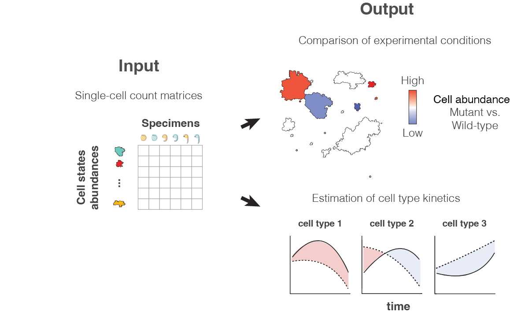

# Overview
        
Hooke is a new software package that uses Poisson-Lognormal models to perform differential analysis of cell abundances for perturbation experiments read out by single-cell RNA-seq. This versatile framework allows users to both perform multivariate statistical regression to describe how perturbations alter the relative abundances of each cell state and visualize cell type abundance kinetics. 

